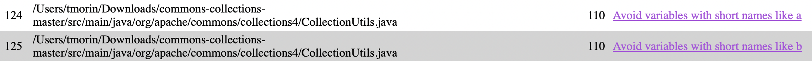

# Using PMD

Pick a Java project from Github (see the [instructions](../sujet.md) for suggestions). Run PMD on its source code using any ruleset. Describe below an issue found by PMD that you think should be solved (true positive) and include below the changes you would add to the source code. Describe below an issue found by PMD that is not worth solving (false negative). Explain why you would not solve this issue.

## Answer

Voici un exemple de problème dans le code que PMD a trouvé.



````java
/**
* Create a new CardinalityHelper for two collections.
* @param a  the first collection
* @param b  the second collection
*/
CardinalityHelper(final Iterable<? extends O> a, final Iterable<? extends O> b) {
    cardinalityA = CollectionUtils.<O>getCardinalityMap(a);
    cardinalityB = CollectionUtils.<O>getCardinalityMap(b);
}
````

Il faut mettre un nom de paramètre plus explicite.
Solution :

````java
/**
* Create a new CardinalityHelper for two collections.
* @param firstCollection  the first collection
* @param secondCollection  the second collection
*/
CardinalityHelper(final Iterable<? extends O> firstCollection, final Iterable<? extends O> secondCollection) {
    cardinalityFirstCollection = CollectionUtils.<O>getCardinalityMap(firstCollection);
    cardinalitySecondCollection = CollectionUtils.<O>getCardinalityMap(secondCollection);
}
````

Voici un exemple de faux-positif. Ici, l'erreur est supposée être que ```==``` est utilisé plutôt que ```equals()```. Cependant, si on regarde la méthode, le choix d'utiliser ```==``` est volontaire car le but est d'éviter d'utiliser la méthode ```equals()``` de la classe ```List```.

````java
public static boolean isEqualList(final Collection<?> list1, final Collection<?> list2) {
    if (list1 == list2) {
        return true;
    }
    if (list1 == null || list2 == null || list1.size() != list2.size()) {
        return false;
    }
    
    final Iterator<?> it1 = list1.iterator();
    final Iterator<?> it2 = list2.iterator();
    Object obj1 = null;
    Object obj2 = null;
    
    while (it1.hasNext() && it2.hasNext()) {
        obj1 = it1.next();
        obj2 = it2.next();
        
        if (!(obj1 == null ? obj2 == null : obj1.equals(obj2))) {
            return false;
        }
    }
    
    return !(it1.hasNext() || it2.hasNext());
}
````